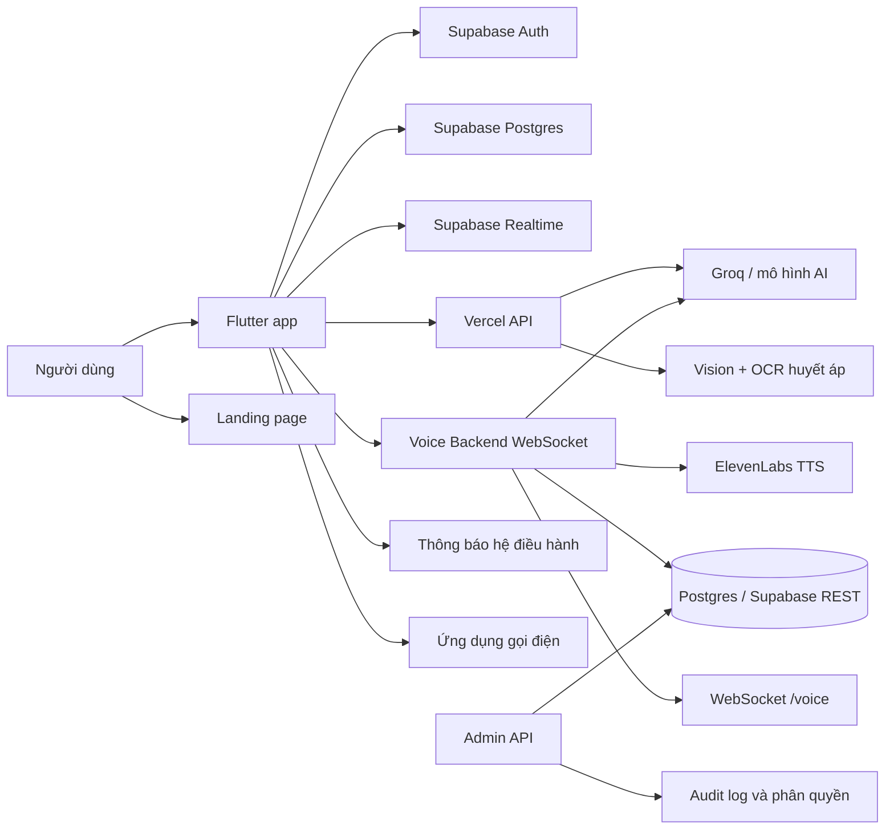

# DiVie — Giới thiệu công nghệ và kỹ thuật

> Tài liệu được lập từ việc rà soát mã nguồn trong workspace ngày 13/08/2026.
> Nội dung mô tả theo code hiện có, không coi các phần chưa được kiểm thử đầu-cuối là đã sẵn sàng production.

## 1. Tổng quan sản phẩm

DiVie là ứng dụng hỗ trợ người cao tuổi và người thân trong các nhu cầu:

- Trợ lý giọng nói và thao tác rảnh tay.
- Nhắc uống thuốc và ghi nhận trạng thái đã uống, bỏ qua hoặc dời lịch.
- Chụp ảnh máy đo huyết áp để đọc chỉ số bằng OCR/AI.
- Gọi hỗ trợ khẩn cấp.
- Tin nhắn, cuộc trò chuyện trực tiếp và danh bạ.
- Hai chế độ sử dụng trên cùng một tài khoản: **Người cao tuổi** và **Người thân**.
- Khu vực quản trị để theo dõi người dùng, phiên voice, hội thoại và dữ liệu sức khỏe.

Workspace hiện được chia thành các phần:

| Thư mục | Vai trò |
| --- | --- |
| `app/` | Ứng dụng Flutter cho thiết bị di động và các target Flutter khác |
| `backend-source/divie-production/` | API serverless triển khai theo mô hình Vercel |
| `backend-source/voice-backend/` | Backend realtime voice chạy bằng Node.js, WebSocket và Docker |
| `backend-source/admin-api/` | API quản trị và vận hành hệ thống |
| `web/` | Landing page viết bằng React, Vite và TypeScript |
| `docs/` | Tài liệu, ảnh tham chiếu và tài liệu kỹ thuật |

Trong backend đang tồn tại cả tên `DiVie` và `VieGrand`. Đây là khác biệt tên gọi trong các package/service hiện có, không nên hiểu là hai sản phẩm độc lập. Khi chuẩn bị phát hành chính thức cần thống nhất branding, tên package, hostname, image Docker và tên service.

## 2. Kiến trúc tổng thể



### Nguyên tắc chính

1. Flutter là lớp giao diện và điều phối trải nghiệm người dùng.
2. Supabase là nền tảng xác thực, dữ liệu và realtime chính.
3. Secret của Groq, ElevenLabs, service-role hoặc database không nằm trong app.
4. App gọi API trung gian cho AI/OCR; app không gọi trực tiếp nhà cung cấp AI.
5. Voice backend là service độc lập, có thể đóng gói và di chuyển bằng Docker.
6. Dữ liệu nhạy cảm được bảo vệ bằng RLS ở tầng Postgres và kiểm tra quyền ở API quản trị.

## 3. Công nghệ sử dụng

### 3.1. Ứng dụng Flutter

| Hạng mục | Công nghệ/kỹ thuật |
| --- | --- |
| Framework | Flutter |
| Ngôn ngữ | Dart `^3.12.2` |
| Xác thực/dữ liệu | `supabase_flutter` |
| Thông báo cục bộ | `flutter_local_notifications` |
| Múi giờ lịch nhắc | `timezone`, cấu hình `Asia/Ho_Chi_Minh` |
| Chụp ảnh | `image_picker` |
| Gọi HTTP | `http` |
| Lưu cục bộ | `shared_preferences` |
| Mở ứng dụng điện thoại | `url_launcher` |
| Icon nền tảng | `cupertino_icons` |
| Kiểm thử | `flutter_test`, `flutter_lints` |

Source app có các target Android, iOS, Web, Linux, Windows và macOS. Trải nghiệm chính của DiVie vẫn là mobile; các target còn lại cần được kiểm tra riêng về layout, quyền hệ điều hành, notification và camera.

### 3.2. Supabase

Supabase được dùng cho:

- Đăng nhập bằng email/mật khẩu thông qua Supabase Auth.
- Lấy người dùng hiện tại và session token.
- Bảng `profiles` cho danh bạ.
- Bảng chat: `chat_rooms`, `chat_participants`, `chat_messages`.
- RPC `create_or_get_direct_chat` để tạo hoặc lấy cuộc trò chuyện trực tiếp.
- Bảng nhắc thuốc, thiết bị và lịch sử trạng thái.
- Postgres Row Level Security (RLS).
- Realtime cho hồ sơ, phòng chat, tin nhắn và reminder.

App có cơ chế fallback cục bộ cho nhắc thuốc khi Supabase chưa được cấu hình. Đây là hỗ trợ phát triển/offline, không phải thay thế cho đồng bộ production.

### 3.3. API serverless trên Vercel

`backend-source/divie-production/` là một service TypeScript chạy theo mô hình Vercel Function. Handler sử dụng trực tiếp `node:http` (`IncomingMessage`/`ServerResponse`), không dùng Express hoặc NestJS.

Các nhóm endpoint hiện có:

| Nhóm | Mục đích |
| --- | --- |
| `/health`, `/api/health` | Kiểm tra service |
| `/ready` | Kiểm tra khả năng sẵn sàng |
| `/api/ai/chat` | Trả lời hội thoại bằng Groq |
| `/api/ai/intent` | Phân tích ý định người dùng |
| `/api/vision/describe` | Mô tả ảnh bằng model vision |
| `/ocr/blood-pressure` | Đọc ảnh máy đo huyết áp và trả về dữ liệu có cấu trúc |
| `/openai/realtime/client-secret` | Endpoint được giữ lại nhưng đang bị vô hiệu hóa trong Vercel adapter |

Kỹ thuật bảo vệ trong handler:

- Kiểm tra CORS.
- Giới hạn kích thước body JSON.
- Parse JSON có xử lý lỗi.
- Dùng biến môi trường cho API key/model/URL.
- OCR yêu cầu kết quả JSON có cấu trúc, kiểm tra range và confidence.
- Kết quả OCR có cờ `requiresConfirmation`, phù hợp với dữ liệu sức khỏe không nên tự động ghi nhận mù quáng.
- Trả mã HTTP và lỗi có cấu trúc để app hiển thị đúng trạng thái.

### 3.4. Voice backend

`backend-source/voice-backend/` là service realtime độc lập:

- Node.js `>=22`.
- TypeScript.
- WebSocket qua thư viện `ws`.
- Groq để stream câu trả lời ngôn ngữ.
- ElevenLabs để tổng hợp giọng nói.
- PostgreSQL hoặc Supabase REST cho persistence.
- Pino cho logging có cấu trúc.
- Zod cho kiểm tra dữ liệu đầu vào.
- Vitest cho unit test.
- Docker và Docker Compose cho local/VPS.

Endpoint và contract chính:

- HTTP `/health`, `/ready`, `/version`.
- HTTP `/ocr/blood-pressure`.
- WebSocket `/voice`.
- Sự kiện vào: `session.start`, `user.text`, `user.interrupt`, `session.end`, `session.ping`.
- Sự kiện ra: `session.started`, `state`, `assistant.text.partial`, `assistant.text.done`, `assistant.audio`, `assistant.audio.done`, `assistant.interrupted`, `error`, `session.ended`.

Pipeline voice:

```text
Client mở phiên
      ↓
Voice Gateway xác thực và nhận sự kiện
      ↓
Session Manager quản lý trạng thái phiên/lượt nói
      ↓
Groq stream token
      ↓
StreamingTextAssembler / SemanticChunker tách câu tự nhiên
      ↓
ElevenLabs stream audio
      ↓
Trả text và audio chunk về Flutter
      ↓
Ghi event, usage, latency và kết quả action
```

Các kỹ thuật đã có trong source:

- Hỗ trợ ngắt lời và hủy lượt xử lý.
- Canned response để giảm độ trễ cho một số câu trả lời được định nghĩa sẵn.
- Chọn voice profile.
- Chunking theo ngữ nghĩa để TTS không phải chờ toàn bộ câu trả lời.
- `LatencyTracker` để theo dõi độ trễ pipeline.
- `CacheManager` cho câu trả lời dựng sẵn.
- `ActionPlanner` nhận diện yêu cầu điều hướng như mở trang sức khỏe, chat, danh bạ, cài đặt.
- Ghi `voice_sessions`, `voice_turns`, `voice_events`, `provider_calls`, usage và action result.
- Cơ chế graceful shutdown cho SIGINT/SIGTERM.

Lưu ý: source backend đã có contract voice khá rõ, nhưng cần xác nhận Flutter app hiện tại đã có client WebSocket tương ứng hay chưa. Trong app source được rà soát, phần kết nối chắc chắn đã thấy là Supabase và HTTP OCR; không nên coi voice end-to-end là hoàn tất nếu chưa test thật trên emulator/thiết bị.

### 3.5. Admin API

`backend-source/admin-api/` là Node.js/TypeScript HTTP service độc lập, cũng sử dụng `node:http`.

Các nhóm nghiệp vụ:

- `/api/admin/me`, `/api/admin/overview`, `/api/admin/health`.
- Danh sách và chi tiết người dùng.
- Cập nhật xác minh, gói sử dụng, vai trò và trạng thái moderation.
- Xem và review voice sessions.
- Xem và review conversations.
- Xem dữ liệu đo sức khỏe với quyền support trở lên.
- Xem phòng chat và xóa mềm tin nhắn với quyền phù hợp.
- Xem audit log với quyền admin.

Phân quyền admin theo thứ bậc:

```text
viewer < support < admin < owner
```

Auth hỗ trợ:

- Bootstrap token cho vận hành ban đầu.
- Supabase JWT + bảng `viegrand_admin_members` cho vận hành chính thức.

API có kiểm soát tự nâng quyền: admin không được tự đổi role của chính mình. Các thao tác nhạy cảm được ghi audit log cùng actor, IP, user-agent và target.

### 3.6. Landing page

`web/` sử dụng:

- React `19`.
- Vite `8`.
- TypeScript `6`.
- `@phosphor-icons/react` cho icon.
- CSS component riêng và các component chia theo section.
- Oxlint cho lint.

Landing page được tách khỏi Flutter app và backend, phù hợp để deploy độc lập trên Vercel hoặc static hosting.

## 4. Kỹ thuật dữ liệu và database

### 4.1. Nhắc thuốc

Migration `001_divie_medicine_reminders.sql` tạo:

- `medicine_reminders`: tên thuốc, giờ uống, ghi chú, bật/tắt, owner account.
- `medicine_reminder_events`: trạng thái theo từng ngày và từng reminder.

Trạng thái event hiện được thiết kế theo hướng:

- `taken` — đã uống.
- `snoozed` — dời lại.
- `skipped` — bỏ qua.

Unique key `(account_id, reminder_id, scheduled_on)` giúp một reminder có một trạng thái duy nhất cho một ngày. App ghi dữ liệu qua `upsert`, vì vậy thay đổi trạng thái có thể đồng bộ lặp lại an toàn hơn.

### 4.2. Thiết bị và vai trò

Migration `002_divie_account_devices_and_realtime.sql` tạo `divie_account_devices` để lưu:

- Tài khoản.
- Device ID.
- Vai trò caregiver/elder.
- Nền tảng.
- Push token.
- App version.
- Trạng thái active và last seen.

App lưu role đang chọn ở `SharedPreferences` với key `divie.active_role`, đồng thời đồng bộ role thiết bị lên backend khi có session Supabase. Đây là role giao diện/thiết bị; quyền dữ liệu cuối cùng vẫn phải được thiết kế và kiểm tra ở backend/RLS.

### 4.3. Chat

Chat được thiết kế theo mô hình:

```text
profiles
   └── chat_participants ── chat_rooms ── chat_messages
```

App:

- Tải danh bạ từ `profiles`.
- Tải các room mà user tham gia.
- Tạo chat trực tiếp bằng RPC.
- Tải tin nhắn theo room.
- Gửi tin nhắn và cập nhật preview/thời gian cuối.
- Dùng Supabase Realtime khi có thể.
- Có polling định kỳ làm fallback khi realtime không phản hồi.

Migration `002_chat_rls.sql` là lớp bảo vệ quan trọng: người dùng chỉ được xem/gửi dữ liệu trong room mà mình tham gia.

### 4.4. Voice và vận hành

Voice backend dùng các bảng phục vụ quan sát và kiểm toán:

- `voice_sessions`.
- `voice_turns`.
- `voice_events`.
- `provider_calls`.
- `usage_daily`.
- `admin_audit_logs`.
- Các bảng review, moderation và assistant actions.

Có function `increment_voice_usage` chạy theo hướng `SECURITY DEFINER`, giúp gom cập nhật usage vào database thay vì để client tự ghi số liệu sử dụng.

## 5. Luồng kỹ thuật chính

### 5.1. Khởi động và đăng nhập

```text
Flutter khởi động
      ↓
Đọc SUPABASE_URL và SUPABASE_ANON_KEY từ dart-define
      ↓
SupabaseBootstrap.initialize()
      ↓
Nếu có session → vào app
Nếu chưa có session → trang đăng nhập
Nếu chưa có cấu hình ở development → cho phép chạy phần local
```

Trong release mode, app chủ động lỗi nếu thiếu cấu hình Supabase. Đây là cách tránh phát hành bản production không có backend.

### 5.2. Nhắc thuốc

```text
Người thân tạo/sửa reminder
      ↓
Ghi medicine_reminders vào Supabase
      ↓
Lên lịch thông báo cục bộ trên thiết bị
      ↓
Đến giờ → hệ điều hành hiển thị notification
      ↓
Người dùng chọn trạng thái
      ↓
Ghi medicine_reminder_events
```

Thông báo cục bộ hiện được cấu hình theo timezone Việt Nam và channel Android riêng. Đồng bộ giữa thiết bị người thân và người cao tuổi cần xác nhận rõ account model, thiết bị đích và quyền chỉnh sửa; RLS hiện bảo vệ theo `account_id`.

### 5.3. OCR huyết áp

```text
Người dùng chọn/chụp ảnh
      ↓
Flutter encode ảnh Base64
      ↓
POST /ocr/blood-pressure
      ↓
Backend gọi model vision/Groq
      ↓
Parse JSON + kiểm tra range/confidence
      ↓
Trả systolic/diastolic/pulse/rawText
      ↓
App hiển thị để người dùng xác nhận
```

OCR là hỗ trợ đọc thông tin, không phải chẩn đoán y khoa. UI và backend nên giữ bước xác nhận trước khi lưu hoặc dùng số liệu để cảnh báo.

### 5.4. Gọi khẩn cấp

App dùng `url_launcher` với URI `tel:115`, chuyển quyền cho ứng dụng gọi điện của hệ điều hành. Backend không thay thế tổng đài và không chịu trách nhiệm kết nối cuộc gọi. Cần test quyền, SIM, thiết bị không có app gọi điện và hành vi trên iOS/Android.

## 6. Bảo mật và vận hành

### Đã có trong source

- Secret backend đọc từ environment variables.
- `.env*`, `.vercel/`, `node_modules/`, `dist/` được ignore theo phạm vi phù hợp.
- Supabase RLS cho dữ liệu theo account/user/room.
- Admin JWT hoặc bootstrap token.
- Phân quyền admin theo role rank.
- Audit log cho thao tác quản trị.
- Soft delete cho tin nhắn quản trị xóa.
- Health/readiness endpoint.
- Giới hạn body và validation ở các API AI/OCR.

### Cần kiểm tra trước production

- Không đưa API key model, service-role key hoặc database password vào Flutter.
- Không dùng bootstrap admin token lâu dài.
- Đặt `CORS_ORIGIN` theo domain thật thay vì `*`.
- Xác nhận toàn bộ migration đã chạy đúng Supabase project tương ứng.
- Kiểm tra RLS bằng user thật, không chỉ bằng service-role.
- Thiết lập rate limit cho AI, OCR, voice và đăng nhập.
- Thêm giới hạn tần suất gọi khẩn cấp và chống spam chat.
- Xác định chính sách lưu/xóa ảnh sức khỏe, audio và log voice.
- Bổ sung monitoring, alerting và backup/restore diễn tập.

## 7. Triển khai

### Flutter app

```powershell
cd app
C:\flutter\bin\flutter.bat pub get
C:\flutter\bin\flutter.bat run `
  --dart-define=SUPABASE_URL="<supabase-url>" `
  --dart-define=SUPABASE_ANON_KEY="<supabase-publishable-key>"
```

Có thể truyền thêm:

```text
DIVIE_API_BASE_URL
DIVIE_VOICE_BASE_URL
```

Không commit các giá trị bí mật vào source hoặc Git.

### Vercel API

```powershell
cd backend-source/divie-production
npm ci
npm run typecheck
npm run build
```

Các biến môi trường chính gồm `GROQ_API_KEY`, `GROQ_MODEL`, `GROQ_VISION_MODEL`, `GROQ_API_URL` và `CORS_ORIGIN`.

### Voice backend

```powershell
cd backend-source/voice-backend
npm ci
npm run typecheck
npm test
npm run build
docker compose -f docker-compose.local.yml up --build
```

Service có Dockerfile và manifest VPS/Traefik riêng. Mô hình này cho phép chạy độc lập, cập nhật image riêng và di chuyển sang VPS khác mà không phụ thuộc vào source Flutter.

### Admin API

```powershell
cd backend-source/admin-api
npm ci
npm run typecheck
npm run build
npm start
```

Admin API có Dockerfile và workflow build/deploy riêng.

### Landing page

```powershell
cd web
npm ci
npm run lint
npm run build
npm run dev
```

## 8. Ma trận trạng thái tính năng

| Tính năng | Dấu hiệu đã có trong code | Trạng thái cần đánh giá |
| --- | --- | --- |
| Đăng nhập | Supabase Auth, login page, session gate | Cần test thật với project Supabase |
| Chọn vai trò | `AppRole`, role selection, lưu local, sync device | Cần hoàn thiện quyền dữ liệu giữa hai vai trò |
| Nhắc thuốc | CRUD Supabase/local, event status, local notification | Cần test đồng bộ nhiều thiết bị và background OS |
| Báo thức | `flutter_local_notifications` + timezone | Cần test permission, reboot, timezone và battery optimization |
| OCR huyết áp | camera/gallery, HTTP API, structured result, confidence | Cần test ảnh thật, lỗi đọc và bước xác nhận |
| Gọi khẩn cấp | `tel:115` qua `url_launcher` | Cần test trên Android/iOS thực tế |
| Danh bạ | profiles + tìm kiếm UI + realtime refresh | Cần test RLS và dữ liệu profile thiếu |
| Chat | rooms/participants/messages, RPC, Realtime, polling | Cần test gửi song phương, mất mạng, duplicate và soft delete |
| Voice | Voice Gateway, Groq, ElevenLabs, session/action/usage | Cần xác minh Flutter WebSocket client và E2E audio |
| Admin | user/voice/chat/health/audit endpoints, roles | Cần UI admin, rate limit và test quyền từng role |
| Landing page | React/Vite componentized page | Cần build/lint và kiểm tra deploy |

## 9. Kiểm thử đề xuất

### Unit test

- Flutter: model, role store, reminder parsing, UI state.
- Voice: text chunker, semantic chunker, streaming assembler, action planner.
- API: parse input, range OCR, lỗi provider, status code.

### Integration test

- Đăng nhập → lấy profile → đổi role → sync thiết bị.
- Người thân tạo reminder → người cao tuổi nhận dữ liệu và notification.
- Chat A gửi → B nhận qua Realtime; mất Realtime thì polling hoạt động.
- Chụp ảnh → OCR → người dùng xác nhận → lưu measurement.
- Voice start → user text → partial text → audio → interrupt → end.
- Admin viewer/support/admin/owner thử đúng và sai endpoint.

### Acceptance test trên thiết bị

- Android/iOS với quyền notification, camera, microphone và phone.
- Ứng dụng bị kill, khởi động lại, mất mạng, mạng yếu.
- Màn hình nhỏ/lớn, font hệ thống lớn, dark mode nếu bật sau này.
- Người cao tuổi thao tác với số bước tối thiểu, text lớn và phản hồi rõ ràng.

## 10. Những điểm kỹ thuật cần ưu tiên tiếp theo

1. Thống nhất tên sản phẩm/service giữa DiVie và VieGrand.
2. Xác nhận mô hình “một tài khoản, hai vai trò” ở tầng dữ liệu, không chỉ ở UI.
3. Hoàn thiện đồng bộ reminder giữa caregiver và elder theo thiết bị/role.
4. Bổ sung push notification từ server nếu cần nhắc trên thiết bị khác khi thiết bị local không hoạt động.
5. Kết nối và kiểm thử Flutter với Voice WebSocket thật.
6. Tạo schema/table lưu kết quả đo sức khỏe có audit và consent rõ ràng.
7. Hoàn thiện admin UI và bộ test quyền theo role.
8. Thiết lập CI bắt buộc: Flutter analyze/test, web lint/build, API typecheck/test/build.
9. Thiết lập monitoring, error tracking, backup và quy trình rollback.
10. Viết tài liệu API contract chính thức, thay vì chỉ dựa vào source handler/README.

## 11. Kết luận

Sản phẩm đã có nền tảng kỹ thuật tương đối rõ: Flutter ở phía client, Supabase cho auth/data/realtime, API Vercel cho AI/OCR, voice backend Docker hóa cho luồng realtime và admin API cho vận hành. Điểm mạnh là các service đã được tách tương đối độc lập, có migration, health check, logging, RLS và một số unit test.

Điểm cần tránh là đánh đồng “đã có source” với “đã hoàn tất sản phẩm”. Các phần cần được chứng minh bằng kiểm thử thực tế là đồng bộ hai vai trò, notification khi app chạy nền, OCR ảnh thật, voice audio hai chiều, RLS theo từng trường hợp và triển khai production có observability. Sau khi hoàn thiện các điểm này, DiVie có thể phát triển theo hướng module hóa mà không phải viết lại toàn bộ nền tảng.
